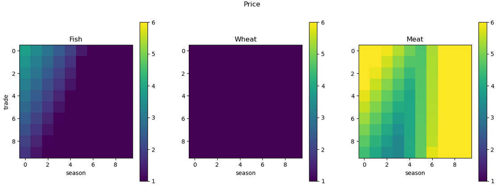
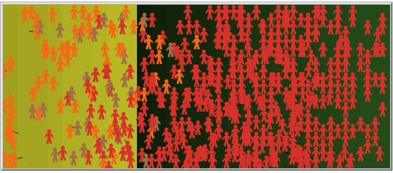
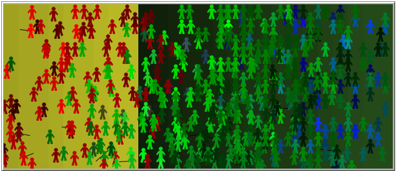
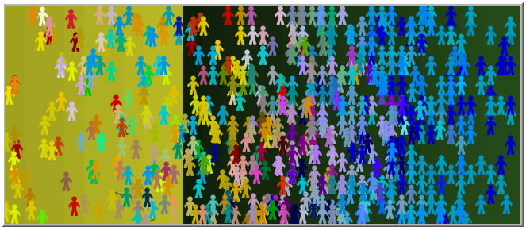
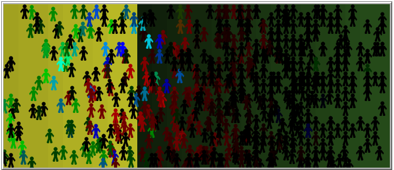
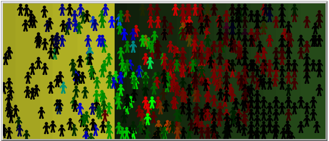

# Agent-Based Modelling: Price Determination with Evolutionary Strategies

This model attempts to create and simulate a basic **production–consumption–trade cycle** consisting of agents capable of evolving feed-forward neural networks.

For a detailed explanation, please refer to **Oezmen_ABM_final_report.pdf**.

---

## Setup

Each agent is represented by a **genome of 4 genes**, each encoding the weights of a neural network that governs:

- Production strategy  
- Consumption strategy  
- Trade strategy  
- Movement strategy  

Agents also have **internal states** (energy, age, inventory, reputation, charm) and follow **rule-based constraints** that govern survival, reproduction, and movement.

The environment contains **three goods**, each satisfying a different level of need:

- **Fish** – survival-critical  
- **Meat** – survival-critical  
- **Wheat** – luxury good  

Production depends on **spatial location** and **seasonal availability**.

### Simulation Cycle

Each tick of the simulation follows this order:

1. Produce  
2. Consume  
3. Exchange (Trade)  
4. Move  
5. Mate  
6. Evaluate Survival  
7. Age or Die  

Agents decide production, consumption, exchange, and movement using their neural networks.

---

## Results

Since there is **no explicit reward function**, the only evaluation criterion is survival. Both of the following are considered valid outcomes:

- A single self-sufficient agent forming a stable system  
- A complex multi-agent trade network  

Evaluation focuses on **emergent dynamics**, rather than predefined objectives.

### Evolutionary Pressure

Random initialization often produces unstable populations. To guide evolution, we use a **nutrition multiplier**, which scales the value of consumed goods:

- Start with a high multiplier → survival is easy, self-sufficiency is possible  
- Gradually decrease multiplier → survival becomes harder, trade becomes necessary  

This creates **gradually increasing environmental pressure**, allowing strategies to stabilize before being tested under harsher conditions.

---

### Luxury Goods

Luxury goods, like wheat, **do not affect survival directly** but increase mating probability. Their effects include:

- Acting as a **medium of exchange**, often stabilizing at a price of 1  
- Encouraging **risk-taking**, allowing agents that pursue luxury to dominate long-term  

---

### Population Genetics

Starting from random genomes, the population often splits into **1–3 distinct clusters**, influenced by spatial separation and trade.  

Rules to remember:

1. Production is regionally constrained and affected by genes  
2. Trade proximity also facilitates mating, driving genetic diffusion  

Population types:

- **Conservatives:**  
  - Minimal or no trade  
  - Low genetic diversity  
  - Resistant to innovation  
  - Survival depends on competition with other societies  

- **Traders:**  
  - Genetically diverse  
  - Interdependent through trade  
  - More successful long-term  
  - Fragile to trade network disruptions  

- K-means clustering of agent genomes
  

---

### Trade Cycles

Societies capable of coordination **emerge naturally** through evolutionary pressure and luxury goods. This is **not classical neural network optimization**, as success depends on **interactions with other agents**.  

Example visualizations:

- **Production:** Split into 3 regions (Fish-left, Meat-right, Wheat-seasonal)  

- **Consumption:** More uniform due to trade  

- **Trade buy orders:** Cyclic behavior transfers Fish → right, Meat → left  

  
  

- **Individual trade strategy by season:**  

