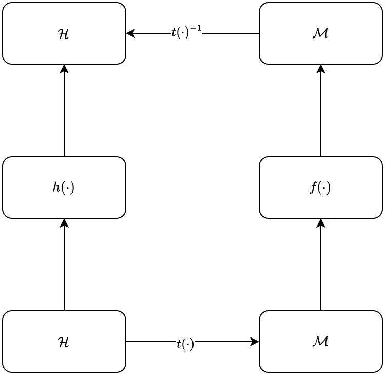

#Lossless Neuro Evolution

The following is an ontological discussion about models of knowledge. For the actual work please refer to **Oezmen_ABM_final_report.pdf** 

# What is an AI model not?

## What is an AI model

To understand what lacks with the mainstream AI models, we must first define what is an AI model. And before that, we must define what we expect it to do, so we can define a lack of "ability"

## World of functions and World of real objects

In ML domain, we assume that the world can be described by functions. At least working with computers requires us to speak the language of functions. However, by doing so, we also start seeing the world through the language of functions. What I mean is that, the real objects (abstract like words, or real like objects) in the real world are digitilized, represented in a computer memory, and basically the infinite complexity of real life is discritized. 

Imagine that you are trying to build a game like Minecraft, where your universe has some basic building blocks, and you can end up creating doom running machines using these basic blocks, however you are a very lazy programmer. All the basic blocks and their interactions has to be hand-codded, depending on this architecture and how you configure your parameters, you will end up with programs that have different capabilities. Achieving the highest capability, a turing complete program, is in theory not very hard, however making it interesting and a well balanced game is hard.

For example you can write a very accurate physics engine, using newtonian mechanics, where you model your environment as 1m^3 blocks, and your character can live as a different object that is associated with health and some other attributes with it's own rules and dynamics. Here you are getting close to the philosophy of object oriented programming.

Or, if you are lazy and scientifically mysticist enough, you might want to discover the theory of everything, and hopefully model 10 or 15 elemantery particles, forces etc. to create your basic dynamics. In this world, it will be almost impossible to figure out the right parameters to represent the game you imagine, however if you can do, then the open-world would literally be an open-world.

However, back to beginning, since this simulation of theory of everything lives on a computer, which is essentially a turing machine, technically we were able to create this super complex dynamics also on Minecraft. 

### Where do we live?

When one stay in computer science and ML, one forgets that the computational universe theory is just a theory. Thus this bring us to the question, is real life even a computable object. Can it ever be represented in a finite space? I will simply assume a simple "no" as an answer to this question. 

Now I will make 3 assumptions. 2 About physical domain and 1 about the time domain
  
  1 It is a materialistic world,where we will not explain human by metaphysical objects (like a soul), and we will assume that humans are computational 
  
  2 A boundry between a human and the outside world exists, where we interact with this outside world through our senses and actions (https://en.wikipedia.org/wiki/Here_is_one_hand)
  
  3 Time and causality exists, thus the ordering of events is important and effects other events only in forward time direction

fundamentally, we humans can achive some kind of intelligence, even though we consist of a physically finite space. Thus, I will assume that we create a representation of real world, which is good enough to call "intelligence", and we set this also as our goal to achive with artificial kind of intelligence.

### A computational model of human

So far so good. With our assumptions above, then we can define human as an abstract computational object, a function, that senses and take actions, and most importantly learns, thus this function changes over time. What kind of a space does this function live in? Well, we don't understand necessarily, and we try to represent it as mathematical objects in our neurobiology theories (as voltages that are activated by photones or physical forces etc), however it's not important to quantify this. 

### Where does an AI model live?

Most mainstream AI models lives as a practical mathematical object, a function, usually assumed to be ideally differentiable, that has a domain and range in the Memory space (physical), and this function is encoded as instructions to be executed on a computational unit that can read from and write to this memory space. 

However, generally this memory space is higly structered, as in RGB encoding for images, or ASCII representation of text, or mp3 representation of a sound. Thus, the senses available to any AI model is defined by our technological recording capabilities and the capabilities of the machines they are working on, as well as senses available to humans are defined by their biological capabilities.

Comparing these two domains, and coming up with arguments about which one is capable of what is a very hard task, that I have no intuition about yet. The domains I am talking about until now "ilgilendirmek" only the 1st and 2nd assumptions.

When we also consider the time and casuality part, maybe we can start to see some differences

Let's for now treat these physical operations as mathematical objects, so an AI model is a function from the memory space to memory space $`f : \mathcal{M}^n \to \mathcal{M}^m`$, and a human is a function from our sense space to our sense space $`h : \mathcal{H}^n \to \mathcal{H}^m`$. And we also know some invertible transformations between these spaces, $`t : \mathcal{M}^n \to \mathcal{H}^m`$

Now, we don't have to assume that this function is differentiable, there are training methods that doesn't rely on differentiatons, but for the sake of simplicity, I'll assume that this function is differentiable. 
